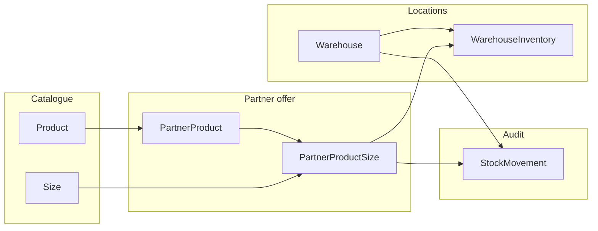

# Feetfirst Project

## How shoe stock works

This backend stores **shoe stock at the granularity of partner + catalogue product + shoe size**. Multi-warehouse retailers get an extra breakdown per warehouse. Movements write an **audit log** (`StockMovement`) and, for most flows, synchronise **`PartnerProductSize.quantity`** and **`WarehouseInventory.quantity`**.

### The main tables (mental model)

- **`Product`** — The global catalogue shoe model (brand, description, widths, sizing tables linked to fitting). It **does not** hold sellable quantities on its own.
- **`PartnerProduct`** — “This partner sells this catalogue product” with **price, SKU, season, colours**, etc. One row per partner and product. Stock is **not** stored only here; it is rolled up from size rows.
- **`PartnerProductSize`** — The **real stock line** for footwear: a single partner’s offer of one product in **one concrete size** (linked to `Size`), with:
  - **`quantity`** — how many pairs you have for that size line.
  - Optional **`warehouse`** — if set, this row is tied to a specific store/branch warehouse; you can also have rows with `warehouse` empty (“unassigned”) depending on how you use the app.
  - **`min_stock`** / **`reorder_point`** — hints for low-stock and reorder alerts.
  - **`ean_code`** — barcode for that size variant.
- **`Warehouse`** — A physical (or logical) location owned by a **partner** (user with partner role). Many-to-many with `PartnerProduct` describes which article is generally stocked there; **actual counts** per size still live in `PartnerProductSize` and `WarehouseInventory`.
- **`WarehouseInventory`** — One row per **(warehouse, partner-product-size)** pair with a cached **`quantity`**. It should stay aligned with movements when the automatic update path runs (see below).
- **`StockMovement`** — Every important stock change (receipt, sale, transfer, etc.) with **type**, **quantity**, **source/destination warehouse**, links to **product / partner product / partner size**, optional link to **manufacturer order** or **order line**, and an auto-generated **`reference_number`** for traceability.

### End-to-end flow (plain language)

1. **Catalogue** — Admins create `Product` + sizes (`Size` / `SizeTable`) and images; partners get a `PartnerProduct` and attach **which sizes** they sell via `PartnerProductSize` rows.
2. **Buying from suppliers** — `ManufacturerOrderUpload` + `OrderItem` describe purchase orders (often from Excel/AI). When goods arrive, you record **goods receipt** as `StockMovement` rows (type `goods-receipt`) pointing at the right **warehouse** and **`PartnerProductSize`** so quantities go up.
3. **Selling** — Customer `Order` / `CartItem` lines point to a specific **`PartnerProductSize`** (the exact size line with stock). When you register a **sale** or **picking** movement, quantities for that size (and warehouse inventory row) go down.
4. **Moving stock between stores** — `StockMovement` with type **`transfer`** uses **`location`** (from) and **`destination_location`** (to). The model updates both sides of `WarehouseInventory` and does **not** change the total on `PartnerProductSize` the same way as a simple add/subtract (it moves between bins).

### Which movement types change stock?

When a **new** `StockMovement` is saved with a **`product_size`** (`PartnerProductSize`), **`quantity` > 0**, and **`skip_inventory_update`** is not used, the model updates inventory as follows (from `StockMovements.models`):

| Movement type | Effect on stock |
|---------------|-----------------|
| **`order-placed`** | **No change** — informational only. |
| **`goods-receipt`**, **`return`**, **`customer-return`** | **Increase** at `location` for that `PartnerProductSize`. |
| **`sale`**, **`picking`**, **`production`**, **`scrap`** | **Decrease** at `location`. |
| **`transfer`** | **Move** quantity from `location` to `destination_location` in `WarehouseInventory` (partner size total unchanged by this logic). |

Some parts of the app (for example POS-style flows) can save a movement **`skip_inventory_update=True`** so the row exists for audit only and **does not** touch `WarehouseInventory` / `PartnerProductSize`; that avoids double-counting when another process already adjusted stock.

### How this connects to carts and orders

- **`CartItem`** references **`partner_product`** and **`size`** (a `PartnerProductSize`). Checking out implies you are reserving or selling **that exact size row**.
- **`Order`** also links to **`PartnerProductSize`** (`size`), so fulfilment should match **the same line** movements use when you post sales or picks.

### Design reasons (why it is structured this way)

- **Partners share one catalogue (`Product`)** but hold **their own quantities and pricing** (`PartnerProduct` + `PartnerProductSize`) — avoids duplicating catalogue data for every retailer.
- **Sizes are explicit rows** — shoes need per-size barcode and quantity, not a single “stock” number on the parent product.
- **`WarehouseInventory` + `StockMovement`** — supports **multi-location** shops and a **full history** of every change (compliance, debugging, reporting).
- **Manufacturer orders** stay separate from retail stock until you **receive** goods into `PartnerProductSize` / movements — purchase data and on-hand stock stay clearly separated.

### Quick diagram



For a **full Prisma-flavoured map** of all models (not only stock), see `prisma/schema.prisma` in this repository.

**For a separate, detailed explanation of shoe stock — every table and field involved, and exact movement behaviour — open [`docs/STOCK_GUIDE.md`](docs/STOCK_GUIDE.md).**

## Overview

Feetfirst is a comprehensive web application designed to manage user accounts, product catalogs, customer inquiries, and onboarding surveys. It provides a robust backend for handling various business processes, including secure authentication, product management, and PDF file uploads.

## ✨ Key Features

### 👤 User Management
- **Secure Authentication**: JWT token-based authentication with email/password and Google OAuth
- **OTP Verification**: Secure account verification via one-time passwords
- **Password Management**: Reset, change, and recover passwords
- **Profile Management**: Update user details, addresses, and preferences
- **Account Security**: Deletion requests and suspension handling

### 👟 Product Catalog
- **Multi-level Categorization**: Main categories and subcategories
- **Advanced Filtering**: By size, color, gender, brand, and price
- **Product Matching**: AI-powered foot scan matching with percentage scores
- **Size Recommendations**: Personalized sizing based on foot scans
- **Favorites System**: Save and manage favorite products
- **PDF Specifications**: Technical documentation uploads and downloads

### 🦶 Foot Scanning
- **Scan Analysis**: Detailed foot measurements (length, width, arch index)
- **Size Conversion**: Automatic size recommendations across brands
- **Excel Reports**: Download detailed scan reports
- **Product Matching**: Algorithm to find best-fitting footwear

### 🔍 Discovery Features
- **Smart Suggestions**: Recommended products based on scans and preferences
- **Q&A Matching**: Find products matching user questionnaire answers
- **Viewing History**: Track recently viewed products

### 📊 Surveys & Engagement
- **Onboarding Surveys**: Customizable user preference questionnaires
- **Contact System**: Customer inquiry management
- **Feedback Collection**: Gather user experience data

### 🛠️ Admin Features
- **Django Admin**: Comprehensive backend management
- **Content Management**: Add/edit products, categories, and specifications
- **User Management**: View and manage all user accounts
- **Analytics**: Track system usage and engagement

## API Endpoints

The Feetfirst project exposes a set of RESTful APIs to interact with its various functionalities. Below is a consolidated list of the main API endpoints:

### Core Endpoints (`/api/`)

-   `/admin/`: Django Admin interface.
-   `/api/users/`: Includes all user-related API endpoints.
-   `/api/products/`: Includes all product-related API endpoints.
-   `/api/surveys/`: Includes all survey-related API endpoints.
-   `/api/contactus/`: Endpoint for contact inquiries.
-   `/api/token/`: Obtain JWT authentication token.
-   `/api/token/refresh/`: Refresh JWT authentication token.

### Accounts Endpoints (`/api/users/`)

-   `/api/users/`: User list and creation.
-   `/api/users/update/`: Update user profile.
-   `/api/users/reset-password/`: Reset user password.
-   `/api/users/get-otp/`: Get OTP for verification.
-   `/api/users/login/`: User login.
-   `/api/users/logout/`: User logout.
-   `/api/users/signup/`: User registration.
-   `/api/users/verify-otp/`: Verify OTP.
-   `/api/users/google/callback/`: Google OAuth callback.
-   `/api/users/change-password/`: Change user password.
-   `/api/users/addresses/`: List and create user addresses.
-   `/api/users/addresses/int:pk/`: Retrieve, update, or delete a specific user address.
-   `/api/users/deletion-request/`: Request account deletion.

### Products Endpoints (`/api/products/`)

-   `/api/products/`: List all products.
-   `/api/products/int:id/`: Retrieve a specific product by ID.
-   `/api/products/upload-pdf/`: Upload PDF files related to products.
-   `/api/products/view/`: View product details.
-   `/api/products/favorites/`: View favourite products.
-   `/api/products/footscans/`: View footscan details.
-   `/api/products/qna-match/`: View QnA match products .
-   `/api/products/footscan/download/`: Download footscan details as exel.
-   `/api/products/suggestions/int:product_id/`: View suggestion products.


### Surveys Endpoints (`/api/surveys/`)

-   `/api/surveys/onboarding-surveys/`: List and create onboarding surveys.

### Contact Endpoints (`/api/contactus/`)

-   `/api/contactus/`: Handle customer inquiries.

## Setup Instructions

To set up the Feetfirst project locally, follow these steps:

1.  **Clone the repository:**
    ```bash
    git clone https://github.com/mhraju69/Feet-First.git
    cd Feetfirst/core
    ```

2.  **Create a virtual environment (recommended):**
    ```bash
    python -m venv venv
    source venv/Scripts/activate  # On Windows
    # source venv/bin/activate    # On macOS/Linux
    ```

3.  **Install dependencies:**
    ```bash
    pip install -r requirements.txt
    ```

4.  **Apply database migrations:**
    ```bash
    python manage.py migrate
    ```

5.  **Create a superuser (for admin access):**
    ```bash
    python manage.py createsuperuser
    ```

6.  **Run the development server:**
    ```bash
    python manage.py runserver
    ```

    The application will be accessible at `http://127.0.0.1:8000/`.

## Docker Setup

This project includes a `Dockerfile` and `docker-compose.yml` for containerized deployment.

1.  **Build Docker images:**
    ```bash
    docker-compose build
    ```

2.  **Run Docker containers:**
    ```bash
    docker-compose up
    ```

    The application will be accessible via the exposed port (usually `8000`).

## Contributing

Contributions are highly welcome! If you'd like to contribute, please follow these steps:

1.  Fork the repository.
2.  Create a new branch for your feature or bug fix.
3.  Make your changes and ensure tests pass.
4.  Submit a pull request with a clear description of your changes.

## License

This project is licensed under the MIT License. See the `LICENSE` file for more details.

## Contact

For any inquiries or support, please contact [Your Contact Information/Email].
